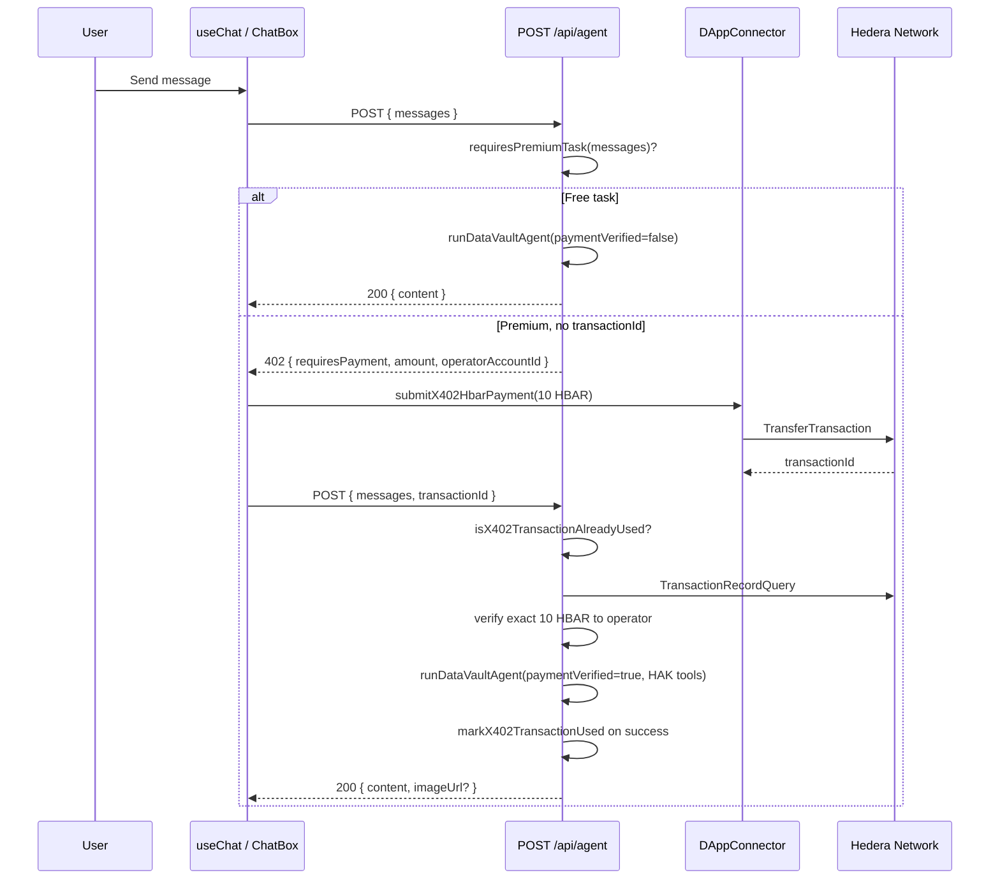

# DataVault AI

## 🚀 Live Demo
**[datavaultai2.vercel.app](https://datavaultai2.vercel.app/)**


**DataVault AI** is a wallet-connected AI agent platform built for the **Hedera AI Bounty**. It demonstrates how premium agent capabilities can be gated behind **on-chain HBAR micropayments** using an **x402-inspired** request/response flow: the server returns HTTP `402 Payment Required` with settlement instructions, the user pays via their Hedera wallet, and the client retries with a `transactionId` proof that the server verifies on-ledger before executing paid work.

---

## Table of Contents

1. [Project Overview & Essence](#1-project-overview--essence)
2. [Key Features & Capabilities](#2-key-features--capabilities)
3. [Tech Stack](#3-tech-stack)
4. [Architecture & Folder Structure](#4-architecture--folder-structure)
5. [Core Logic: x402 Payment-Triggered Execution](#5-core-logic-x402-payment-triggered-execution)
6. [Current Status & Missing Pieces](#6-current-status--missing-pieces)
7. [Environment Variables](#7-environment-variables)
8. [Getting Started](#8-getting-started)

---

## 1. Project Overview & Essence

### What is this project?

DataVault AI is a **Next.js full-stack web application** that combines:

- A **chat-style agent UI** connected to the user's Hedera account via **WalletConnect** (`@hashgraph/hedera-wallet-connect`).
- A **server-side agent API** (`POST /api/agent`) powered by **DeepSeek** (reasoning and tool routing) and **OpenAI Images** (`gpt-image-2`) for premium image generation.
- **Hedera testnet settlement** for premium tasks: **10 HBAR** transferred from the user's wallet to an **operator account** controlled by the server.

### Main goal

Showcase a **production-shaped pattern** for **pay-per-use AI agents on Hedera**:

1. User connects wallet and sends a task in natural language.
2. Server classifies the task as **free** or **premium**.
3. Premium tasks require a **verified on-chain payment** before expensive AI or tooling runs.
4. After payment, the agent runs with **Hedera Agent Kit read-only tools**, optional **mirror context**, and **gated premium tools** (e.g. image generation).
5. Each successful premium settlement **`transactionId` is consumed once** via server-side replay protection.

### Problem solved for the Hedera AI Bounty

| Problem | How DataVault addresses it |
|--------|-----------------------------|
| AI API costs with no on-chain accountability | Premium path charges **10 HBAR** to the operator before image gen / heavy work |
| Trustless payment proof | Server verifies **`transactionId`** via Hiero SDK `TransactionRecordQuery` (exact amount to operator) |
| Wallet-native UX | Payment is signed in the user's wallet (`DAppConnector.signAndExecuteTransaction`) |
| Hedera ecosystem fit | Uses **HBAR**, **testnet**, **Hedera Agent Kit** query tools, and mirror enrichment |
| Payment replay abuse | **In-memory transaction store** rejects reused `transactionId`s (`TRANSACTION_ALREADY_USED`) |

The bounty theme—**agents that earn and pay on Hedera**—is embodied in the **x402-style gate**: no `transactionId`, no premium execution.

---

## 2. Key Features & Capabilities

Based on the **current implementation**, the agent and app can do the following.

### Wallet and connectivity

- **WalletConnect / Reown** session via `DAppConnector` (Hedera testnet, HIP-30 signer IDs).
- Connect / disconnect UI; chat is **disabled until a wallet is linked**.
- Primary account ID shown in the navbar; used as the **payer** for x402 transfers.

### Chat and UX

- Multi-turn chat with user/assistant bubbles.
- **Phase indicators**: contacting agent, awaiting payment approval, submitting payment, generating response.
- **Soft timeout** (~60s): UI unlocks if generation is slow, but in-flight requests may still complete.
- **Markdown image rendering** in assistant messages plus structured `imageUrl` from the API.
- Auto-scroll and empty-state onboarding copy.

### Free tier (no payment)

Heuristic in `lib/agent/premium.ts` treats these as **non-premium** (no 402):

- Short greetings (`hi`, `hello`, `thanks`, etc.) under ~48 characters.
- General questions that do **not** match premium keywords and are not long/multi-line.

Free requests still call DeepSeek but **without** the premium image tool and **without** mirror enrichment.

### Premium tier (10 HBAR + verification)

Premium is triggered when the latest user message:

- Matches **image generation** phrasing (e.g. "generate an image of…"),
- Matches **premium task** keywords (analyze, report, Hedera, token, on-chain, etc.),
- Or is **long** (≥200 chars) or **multi-line** (≥4 lines).

After verified payment, the server may:

1. **Reject replayed payments** if the same `transactionId` was already consumed for a successful premium run (`TRANSACTION_ALREADY_USED`).
2. **Enrich context** from Hedera mirror if the message contains an account id (`0.0.xxxxx`) — balance and EVM address via `hedera-agent-kit`.
3. Run **DeepSeek** with up to **5 agent steps** and a **gated tool set**:
   - **Hedera Agent Kit** read-only queries: HBAR balance, account info, token info (`HederaAIToolkit` via `lib/hedera/agent-kit.ts`).
   - **`generate_premium_image`** for OpenAI image generation.
4. **Force tool choice** when the user explicitly asked for image generation.
5. Return **text + optional `imageUrl`** (hosted URL or `data:` base64 from OpenAI).

### x402 replay protection

- **`lib/agent/x402-transaction-store.ts`** maintains an in-memory `Set` of `transactionId`s that have completed a successful premium agent execution.
- Before on-chain verification, `POST /api/agent` checks `isX402TransactionAlreadyUsed()` and returns **400** with code **`TRANSACTION_ALREADY_USED`** if the id was already consumed.
- After a successful **HTTP 200** agent response, `markX402TransactionUsed()` records the id so it cannot fund another premium run.
- Failed agent runs do **not** consume the id (the user may retry with the same payment proof).
- The store resets when the Node.js process restarts (no database).

### Hedera Agent Kit (live on-chain queries)

- **`createReadOnlyHederaAiTools()`** in `lib/hedera/agent-kit.ts` wraps `HederaAIToolkit` with `coreAccountQueryPlugin` and `coreTokenQueryPlugin`, limited to:
  - `get_hbar_balance_query_tool`
  - `get_account_query_tool`
  - `get_token_info_query_tool`
- In **`runDataVaultAgent`** (`lib/agent/run-agent.ts`), these tools are merged into the Vercel AI SDK `tools` object **only when `paymentVerified` is true**, alongside `generate_premium_image`.
- The operator Hedera client from payment verification is passed as `hederaClient` so the LLM can invoke mirror queries during the tool loop.

### Image generation (paid)

- Tool: `generate_premium_image` → `executeOpenAIImageGeneration` (`gpt-image-2`, 1024×1024, low quality for speed).
- **Mock mode** (`IS_MOCK_MODE` in `generate-premium-image.ts`): skips OpenAI, returns a sample Unsplash URL (for demos).
- Server strips hallucinated markdown images and injects the **verified** URL from the tool.

### API robustness

- Message validation (roles, length, count limits).
- Payment verification errors with codes (`PAYMENT_VERIFICATION_FAILED`, `TRANSACTION_ALREADY_USED`, `HEDERA_CLIENT_ERROR`, etc.).
- Agent execution timeout (120s) and route `maxDuration` 300s for long image jobs.

### What the agent does not do today

- No server-side **write** transactions (transfers only from the user wallet; Agent Kit tools are **read-only** queries).
- No write-capable Hedera Agent Kit plugins (token create, transfers, etc.) in the LLM loop.
- No streaming SSE responses.
- No persisted chat history (in-memory per session only).
- No durable replay store across server restarts (transaction ids are in-memory only).

---

## 3. Tech Stack

### Frontend

| Technology | Role |
|------------|------|
| **Next.js 16** (App Router) | Pages, API routes, SSR boundaries |
| **React 19** | UI components |
| **Tailwind CSS 4** | Styling (`app/globals.css`) |
| **Geist** fonts | Typography via `next/font` |

### Backend (within Next.js)

| Technology | Role |
|------------|------|
| **`app/api/agent/route.ts`** | Single agent endpoint; x402 gate + agent runner |
| **Node.js runtime** | Hedera SDK and server-only secrets |

### Web3 / Hedera

| Package | Role |
|---------|------|
| `@hiero-ledger/sdk` | Client, transfers, transaction records, payment verification |
| `@hiero-ledger/proto` | Transitive Hiero dependency |
| `@hashgraph/hedera-wallet-connect` | `DAppConnector`, sign and execute transfers |
| `@walletconnect/modal` | WalletConnect UI (via connector) |
| `@reown/appkit`, `@reown/walletkit`, `@reown/appkit-*` | In dependencies; **UI uses `hedera-wallet-connect` directly** |
| `hedera-agent-kit` | `HederaAIToolkit` read-only query tools + mirror reads (`getMirrornodeService`) |

> **Note:** There is **no `lib/hashconnect` folder**. Wallet integration lives under `lib/wallet/` and `contexts/WalletContext.tsx`. The env var `NEXT_PUBLIC_HASHCONNECT_PROJECT_ID` is the **WalletConnect / Reown project ID**.

### AI

| Package | Role |
|---------|------|
| `ai` (Vercel AI SDK v6) | `generateText`, tools, `stepCountIs`, tool choice |
| `@ai-sdk/openai` | DeepSeek via OpenAI-compatible provider |
| `openai` | Optional SDK helpers (`lib/ai/openai.ts`, `deepseek.ts`); **active path uses `deepseek-provider` + raw `fetch` for images** |
| `zod` | Tool input schemas |

### Tooling

- **TypeScript 5**, **ESLint 9** (`eslint-config-next`)
- **PostCSS + Tailwind 4**

---

## 4. Architecture & Folder Structure

```
agentkit/
├── app/
│   ├── api/agent/route.ts    # x402 gate, replay check, verify, run agent
│   ├── layout.tsx            # Root layout and metadata
│   ├── page.tsx              # Home → AppShell
│   └── globals.css
├── components/
│   ├── AppShell.tsx          # WalletProvider + layout shell
│   ├── ChatBox.tsx           # Chat UI, message rendering
│   ├── Navbar.tsx
│   ├── WalletConnect.tsx     # Dynamic import (no SSR)
│   └── WalletConnectInner.tsx
├── contexts/
│   └── WalletContext.tsx     # DAppConnector lifecycle
├── hooks/
│   └── useChat.ts            # Chat state + x402 client orchestration
├── lib/
│   ├── agent/                # Agent brain and x402 server logic
│   │   ├── run-agent.ts      # DeepSeek + HAK + image tools loop
│   │   ├── x402.ts           # 402 payload and on-chain verification
│   │   ├── x402-transaction-store.ts  # In-memory replay protection
│   │   ├── premium.ts        # Free vs premium classification
│   │   ├── client-api.ts     # Browser → /api/agent
│   │   ├── hedera-context.ts # Mirror enrichment after payment
│   │   ├── system-prompt.ts
│   │   └── tools/
│   │       └── generate-premium-image.ts
│   ├── ai/
│   │   ├── deepseek-provider.ts  # Primary LLM (used)
│   │   ├── dalle.ts              # OpenAI Images API (used)
│   │   ├── deepseek.ts / openai.ts  # Legacy helpers (unused by main path)
│   ├── chat/
│   │   └── parse-message-content.ts
│   ├── hedera/
│   │   ├── client.ts         # Operator client (server only)
│   │   ├── network.ts
│   │   └── agent-kit.ts      # READ_ONLY_TOOL_NAMES + createReadOnlyHederaAiTools()
│   ├── wallet/
│   │   ├── x402-payment.ts   # Client-side HBAR transfer
│   │   ├── config.ts
│   │   └── accounts.ts
│   ├── constants.ts          # APP_NAME, X402 amounts, API routes
│   └── env.ts                # Server env accessors
└── types/
    ├── agent-api.ts          # Request/response contracts
    └── chat.ts               # Client chat message shape
```

### Where the main logic lives

| Concern | Location |
|---------|----------|
| **HTTP / x402 / verify / run** | `app/api/agent/route.ts` |
| **Payment required and verify HBAR** | `lib/agent/x402.ts` |
| **x402 replay protection** | `lib/agent/x402-transaction-store.ts` |
| **Premium vs free** | `lib/agent/premium.ts` |
| **Hedera Agent Kit → AI SDK tools** | `lib/hedera/agent-kit.ts` |
| **LLM + tools** | `lib/agent/run-agent.ts` |
| **Wallet pay and retry** | `hooks/useChat.ts` + `lib/wallet/x402-payment.ts` |
| **Wallet session** | `contexts/WalletContext.tsx` |

---

## 5. Core Logic: x402 Payment-Triggered Execution

This project implements an **x402-inspired** flow (HTTP 402 + payment proof + retry). It is **not** a full x402 protocol implementation (no standardized `Payment-*` headers); it uses a **JSON body** with `requiresPayment`, `amount`, `currency`, and `operatorAccountId`.

### End-to-end sequence



### Step 1 — Client sends the task

`hooks/useChat.ts` builds `AgentChatMessage[]` from chat history and calls `callAgentApi()` (`lib/agent/client-api.ts`).

### Step 2 — Server classifies premium vs free

`requiresPremiumTask()` in `lib/agent/premium.ts` inspects the **latest user message** only.

### Step 3 — Premium without proof → HTTP 402

In `app/api/agent/route.ts`:

```typescript
if (premiumTask && !transactionId) {
  return NextResponse.json(buildPaymentRequiredResponse(operatorAccountId), {
    status: 402,
  });
}
```

`buildPaymentRequiredResponse()` (`lib/agent/x402.ts`) returns:

```json
{
  "requiresPayment": true,
  "amount": 10,
  "currency": "HBAR",
  "operatorAccountId": "0.0.xxxxx"
}
```

`operatorAccountId` comes from `HEDERA_ACCOUNT_ID` (server operator).

### Step 4 — Client settles on-chain

On `payment_required`, `useChat`:

1. Sets phase to `awaiting_payment_approval`.
2. Calls `submitX402HbarPayment()` (`lib/wallet/x402-payment.ts`):
   - Builds `TransferTransaction`: payer → operator, **10 HBAR**, memo `"DataVault AI x402"`.
   - Signs via `connector.signAndExecuteTransaction()` with HIP-30 signer id `hedera:testnet:0.0.x`.
   - Extracts `transactionId` from the wallet JSON-RPC result.

### Step 5 — Client retries with proof

Second `callAgentApi(messages, { transactionId })`.

### Step 6 — Replay check

If `isX402TransactionAlreadyUsed(transactionId)` in `lib/agent/x402-transaction-store.ts` returns true, the API responds with **400** and code **`TRANSACTION_ALREADY_USED`** before any further work.

### Step 7 — Server verifies payment on-ledger

`verifyHbarPayment(client, transactionId, operatorAccountId)`:

1. Parses `TransactionId`.
2. Fetches record via `TransactionRecordQuery`.
3. Requires `receipt.status === Success`.
4. Sums **positive** tinybar transfers to the operator account.
5. Requires total === **exactly** `X402_PREMIUM_HBAR_AMOUNT` (10 HBAR).

Failure → `400` with `PAYMENT_VERIFICATION_FAILED`.

### Step 8 — Optional Hedera context (premium + paid)

If the user message contains `0.0.\d+`, `buildOnChainContextSnippet()` queries mirror for account + HBAR balance and appends it to the system prompt.

### Step 9 — Agent execution (gated tools)

`runDataVaultAgent()` (`lib/agent/run-agent.ts`):

| `paymentVerified` | Behavior |
|-------------------|----------|
| `false` | DeepSeek only, `stepCountIs(1)`, **no tools** |
| `true` | Merges **Hedera Agent Kit** read-only tools + `generate_premium_image`; up to 5 steps; may force image tool if image intent detected |

Hedera tools are created via `createReadOnlyHederaAiTools(hederaClient)` and allow the model to query account balances, account details, and token info live from mirror nodes during the conversation.

Image tool calls OpenAI; `onImageReady` captures the real URL; final response merges model text with verified image markdown / `imageUrl`.

### Step 10 — Mark transaction consumed (success only)

On **HTTP 200** after a premium run, `markX402TransactionUsed(settledTransactionId)` records the payment proof so it cannot be reused. Agent failures do not mark the id.

### Constants

Defined in `lib/constants.ts`:

- `X402_PREMIUM_HBAR_AMOUNT = 10`
- `X402_CURRENCY = "HBAR"`

---

## 6. Current Status & Missing Pieces

### Fully functional (as implemented)

- Wallet connect/disconnect on **Hedera testnet** via WalletConnect.
- Chat UI with premium/free routing and payment UX phases.
- **402 → wallet transfer → verify → agent** loop for premium tasks.
- On-chain verification of **exact 10 HBAR** to operator.
- **x402 replay protection** via in-memory transaction store (`lib/agent/x402-transaction-store.ts`): rejects reused `transactionId`s with **`TRANSACTION_ALREADY_USED`**; marks ids consumed only after successful premium execution.
- **Hedera Agent Kit read-only tools** integrated into the premium LLM loop (`lib/hedera/agent-kit.ts` → `runDataVaultAgent`): live HBAR balance, account, and token info queries after verified payment.
- DeepSeek chat for free and paid paths.
- Premium **image generation** via OpenAI `gpt-image-2` after payment (with mock mode toggle).
- Mirror **read-only** system-prompt context when an account id appears in the user message (in addition to Agent Kit tool calls).
- API validation, error codes, timeouts, and abort handling.

- ````markdown
## 🎬 Demo Walkthrough

### Step 1 — Connect Wallet
Click *"Connect Wallet" in the navbar → choose HashPack → approve connection.
Your Hedera testnet account ID appears in the header.

### Step 2 — Free Tier (No Payment)
Type `hello` or `what is your name?` and press Send.
The agent responds immediately using DeepSeek — no HBAR required.

### Step 3 — Trigger Premium Gate
Type: `generate an image of a futuristic Armenian AI city`
The API returns 402 Payment Required with instructions to send 10 HBAR.

### Step 4 — Pay 10 HBAR
HashPack prompts you to sign the transfer. Approve it.
Copy the `transactionId` from the HashPack confirmation.

### Step 5 — Send transactionId for Premium Result
Paste the `transactionId` with your original prompt and send again:
```
generate an image of a futuristic Armenian AI city
transactionId: 0.0.xxxxx@xxxxxxxxxx
```
The server verifies your payment on-ledger, then generates the image via OpenAI + fetches live Hedera data. The result appears in chat with the generated image.

---

Live Demo: [datavaultai2.vercel.app](https://datavaultai2.vercel.app/)

### Needs implementation or refinement

| Area | Gap |
|------|-----|
| **x402 protocol compliance** | Custom JSON 402 body; no standard payment headers / facilitator integration |
| **Premium classification** | Regex/heuristic only—may **false-positive** (long messages) or **false-negative** edge cases |
| **Network config** | Wallet hardcoded to **testnet** in `WalletContext`; operator network from `HEDERA_NETWORK` env—must stay aligned |
| **Mainnet / production** | No deployment guide, rate limits, or operator key rotation story in repo |
| **Persistence** | No database; chat history lost on refresh |
| **Replay store durability** | In-memory only; resets on deploy/restart; no cross-instance ledger |
| **Streaming** | Responses are non-streaming `generateText` only |
| **Reown AppKit** | Dependencies installed; **not used** in UI (direct `DAppConnector` instead) |
| **Legacy AI helpers** | `lib/ai/openai.ts`, `lib/ai/deepseek.ts` unused by main agent path |
| **Documentation / DX** | No committed `.env.example`; env vars discovered from `lib/env.ts` and `lib/wallet/config.ts` |
| **UI copy accuracy** | Chat header mentions "DALL·E 3"; code uses **`gpt-image-2`** |
| **Tests** | No automated tests for payment verification, replay protection, or premium gates |
| **Write-capable Agent Kit** | Only read-only query plugins enabled; no autonomous HTS/account write tools |

### Recommended next steps for bounty polish

1. Add `.env.example` and document testnet operator + WalletConnect setup.
2. Align wallet network with `HEDERA_NETWORK` via env (client + operator on the same ledger).
3. Add integration tests for `verifyHbarPayment` and `x402-transaction-store` replay behavior.
4. Persist consumed `transactionId`s (Redis or DB) for multi-instance / restart-safe replay protection.
5. Fix ChatBox UI copy to reference **`gpt-image-2`** instead of DALL·E 3.

---

## 7. Environment Variables

### Server (required for agent + verification)

| Variable | Purpose |
|----------|---------|
| `HEDERA_ACCOUNT_ID` | Operator account receiving x402 payments |
| `HEDERA_PRIVATE_KEY` | Operator key (server queries transaction records) |
| `HEDERA_NETWORK` | Optional: `testnet` \| `mainnet` \| `previewnet` (default `testnet`) |
| `DEEPSEEK_API_KEY` | Required for agent chat |
| `OPENAI_API_KEY` | Required for premium image generation |

### Server (optional)

| Variable | Purpose |
|----------|---------|
| `DEEPSEEK_MODEL` | Default `deepseek-chat` |
| `OPENAI_MODEL` | Used by unused `createOpenAIClient` helper |

### Client (required for wallet)

| Variable | Purpose |
|----------|---------|
| `NEXT_PUBLIC_HASHCONNECT_PROJECT_ID` | WalletConnect / Reown project ID |

### Client (optional)

| Variable | Purpose |
|----------|---------|
| `NEXT_PUBLIC_APP_URL` | DApp metadata URL |
| `NEXT_PUBLIC_APP_NAME` | DApp name |
| `NEXT_PUBLIC_APP_DESCRIPTION` | DApp description |
| `NEXT_PUBLIC_APP_ICON_URL` | DApp icon |

---

## 8. Getting Started

```bash
npm install
```

Create `.env.local` with the variables in [§7](#7-environment-variables), fund a **testnet** operator account, and ensure users have testnet HBAR for premium tasks.

```bash
npm run dev
```

Open [http://localhost:3000](http://localhost:3000), connect a Hedera wallet, and try:

- **Free:** `Hello`
- **Premium (payment + image):** `Generate an image of a futuristic Hedera vault in space`
- **Premium (payment + on-chain query):** `What is the HBAR balance of account 0.0.1234?`

---

## License

Private project (`package.json`: `"private": true`). Add a license file if you plan to open-source for the bounty submission.
